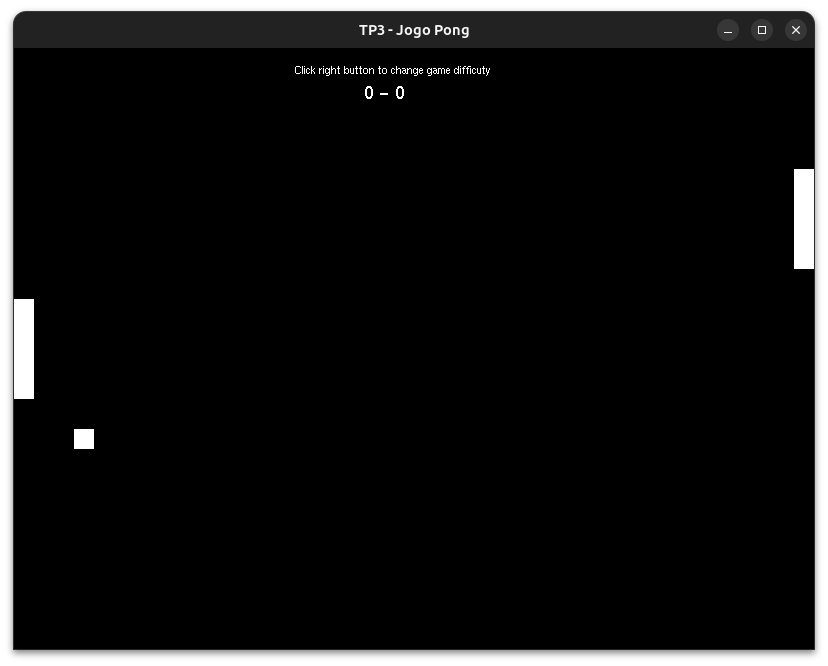
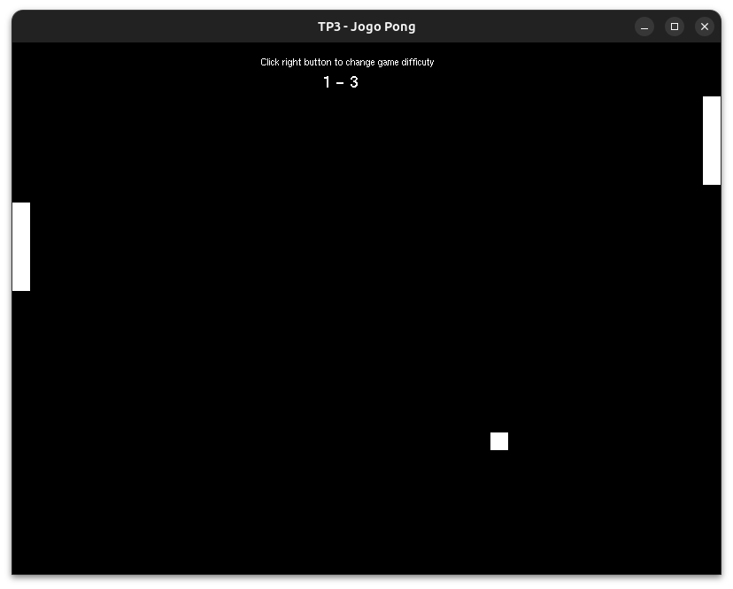
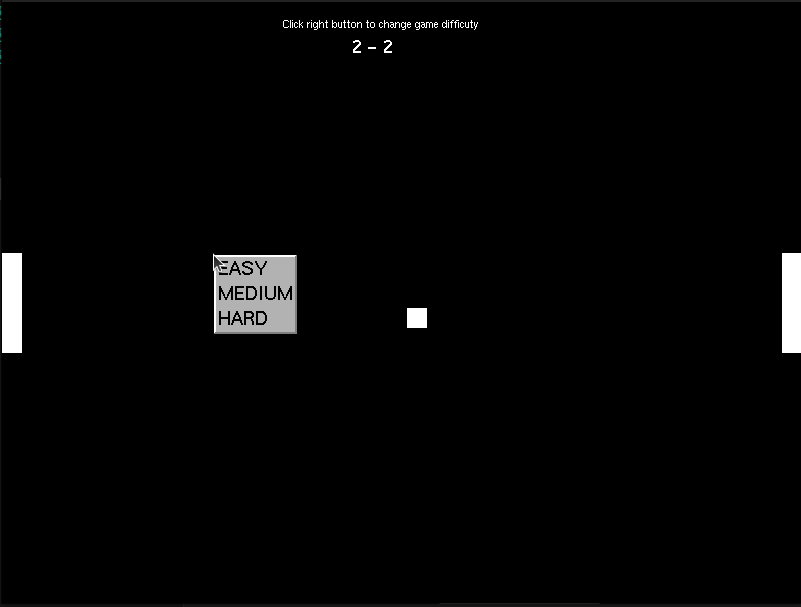
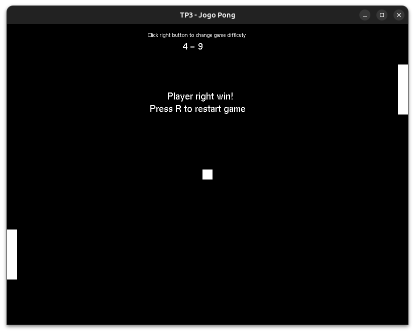

# Pong game in C++ 🏓


**Pong Game** é uma recriação do clássico jogo Pong desenvolvida em **C++** utilizando **OpenGL/GLUT**. O projeto foi feito com fins didáticos na disciplina de Computação Gráfica, explorando conceitos básicos de computação gráfica, entrada do usuário e lógica de jogo.

## 🚀 Tecnologias Utilizadas
- C++
- OpenGL
- GLUT

## 🎮 Controles
### Seleção de dificuldade
- Clique direto do mouse

### Raquete Esquerda (Jogador 1)
- ` W ` – Sobe
- ` S ` – Desce

### Raquete Direita (Jogador 2)
- ` ↑ ` (Seta para cima) – Sobe
- ` ↓ ` (Seta para baixo) – Desce

**🏆 Ganha o jogador que fizer 10 pontos**

## ⚙️ Como Rodar o Projeto
### 📦 Pré-requisitos
- Compilador C++ (g++ recomendado)
- GLUT instalado
  - **Ubuntu/Debian:** `sudo apt install freeglut3-dev`
  - **Windows (MinGW/MSYS2):** `pacman -S mingw-w64-x86_64-freeglut`

### Passo a Passo:
#### Linux 🐧

Clone o repositório:
```bash
# Clone o repositório
git clone https://github.com/gabrielsizilio/jogo-pong.git
```

Atualize/instale as depêndencias:
```bash
# Atualização de dependências
sudo apt update
sudo apt install build-essential freeglut3-dev
```

Navegue para a pasta do jogo:
```bash
# Navegue para a pasta do jogo
cd jogo-pong
```

Compile o jogo *(aqui usamos o g++)*:
```bash
# Compile o jogo
g++ main.cpp -o pong -lglut32 -lopengl32 -lglu32
```
A compilação gerará um arquivo chamado `pong`, basta executá-lo:
```bash
#Execute o jogo
./pong
```

#### Windows 🪟

> ⚠️ É necessário ter o MinGW ou outro compilador C instalado e o make disponível no terminal (ex: Git Bash ou WSL).

Clone o repositório:
```bash
# Clone o repositório
git clone https://github.com/gabrielsizilio/jogo-pong.git
```

Navegue para a pasta do jogo:
```bash
# Navegue para a pasta do jogo
cd jogo-pong
```

Basta executar o makefile:
```bash
# No terminal, execute:
make
pong.exe
```

## 📷 Capturas de Tela
  
  <br/>
  <br/>
  

## Contribuidores 😎

| <a href="https://github.com/gabrielsizilio">  <p>[@gabrielsizilio](https://github.com/gabrielsizilio)</p> </a>| <a href="https://github.com/yodemisj">  <p>[@yodemisj](https://github.com/yodemisj)</p> </a> |
|:---:|:---:|
